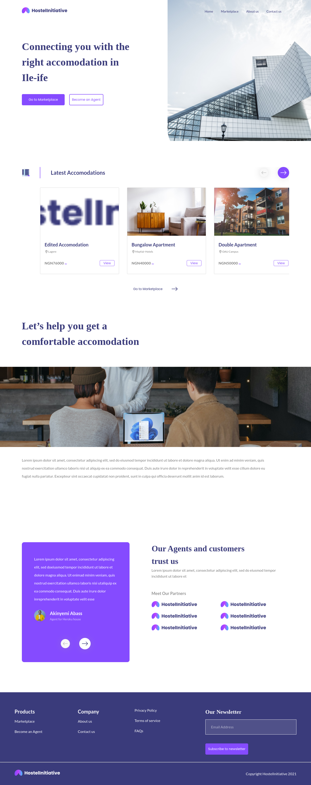
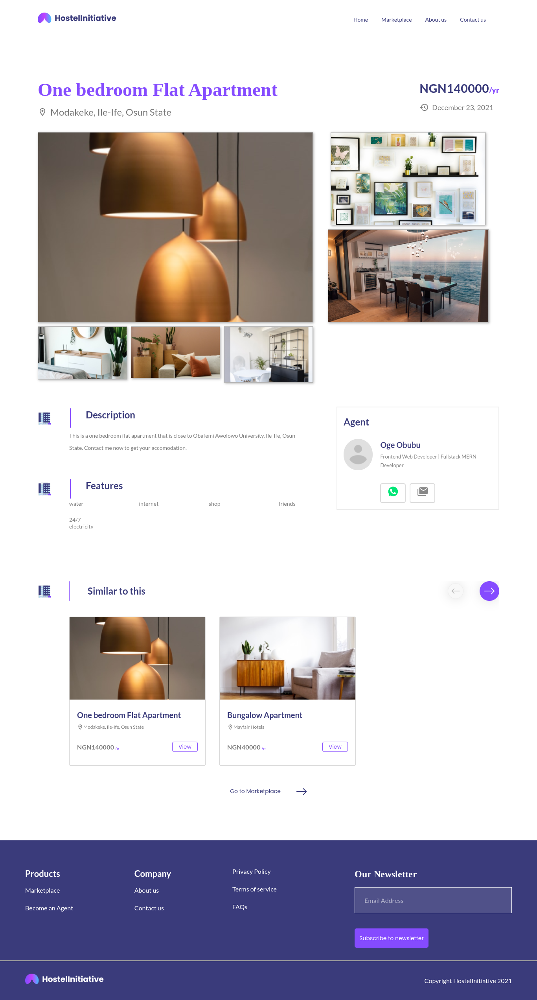
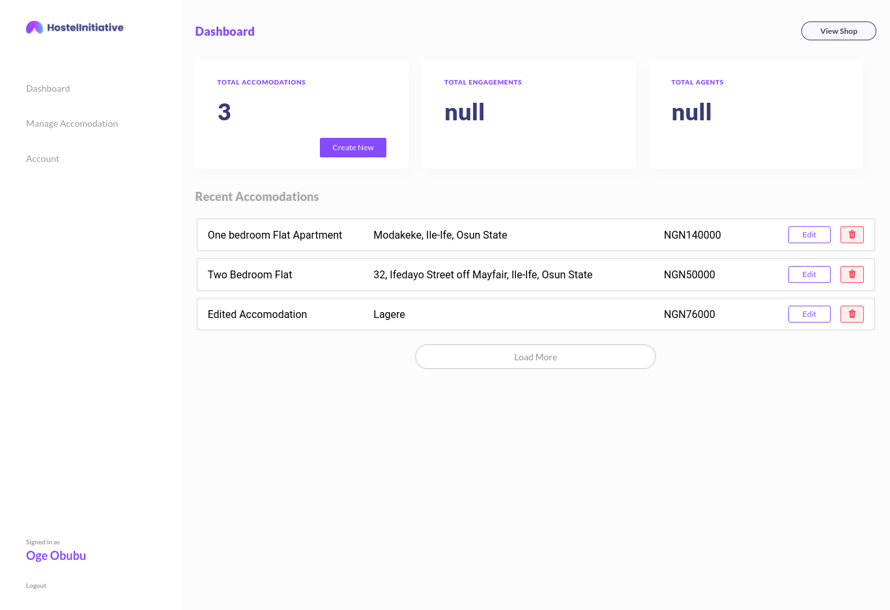
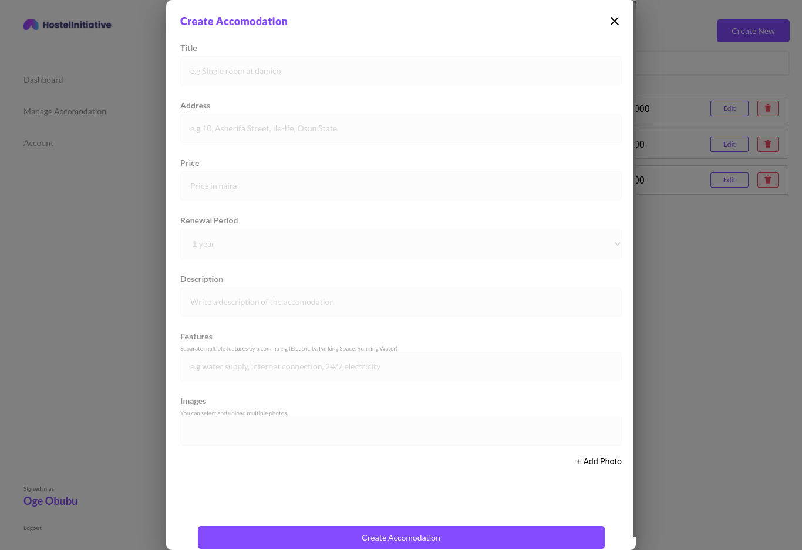

# Hostel Initiative

A system built for hostel accommodation allocation for Obafemi Awolowo University students to connect students with the right accommodation in Ile-Ife, Osun State, Nigeria.

## Installation: Get Started

Make sure you have [npm](https://www.npmjs.com/) or [yarn](https://yarnpkg.com/) installed by running the following command:

```bash
node -v
yarn -v
```
> If you do not have npm installed, install NodeJS [here](https://nodejs.org/en/download/)

> If your node version is less than v14, you would need to update it.

> If you do not have yarn installed, run `npm i -g yarn` in your terminal to install it

## Getting Started With the Frontend/Client (React)

Install dependencies in the root folder,

``cd client`` folder,  and install the dependencies

```bash
yarn install
```

Open [http://localhost:3000](http://localhost:3000) with your browser to see the result.

### Configure .env file

```
DATABASE = Mongo Uri
PORT_PATH = 5000
JWT_SECRET = your secret key
REFRESH_TOKEN_SECRET = your secret key
ACCESS_TOKEN_SECRET = your secret key
```

## Concurrently Run Both (React & Node)

Make sure you are in the root folder

Run the development server using either of the following commands:

```bash
npm run dev
# or
yarn run dev
```

Open [http://localhost:3000](http://localhost:3000) with your browser to see the frontend result and your server would be listening on [http://localhost:5000](http://localhost:5000).

## Technologies / Languages
- ### React
 A free and open-source front-end JavaScript library for building user interfaces based on UI components. It is maintained by Meta and a community of individual developers and companies. React can be used as a base in the development of single-page.

- ### Express
Express.js, or simply Express, is a back end web application framework for Node.js, released as free and open-source software under the MIT License. It is designed for building web applications and APIs. It has been called the framework for Node.js.

- ### MongoDB
MongoDB is a source-available cross-platform document-oriented database program. Classified as a NoSQL database program, MongoDB uses JSON-like documents with optional schemas.

- ### NodeJS
Node.js is an open-source, cross-platform, back-end JavaScript runtime environment that runs on the V8 engine and executes JavaScript code outside a web browser.

## Features / Functionalities

- [x] Register/Login Screens
- [x] Protected/Secure API Routes using JsonWebToken ( jwt )
- [x] Agent Details
- [x] Create Accomodation
- [x] Edit/Delete Accomodation Details
- [x] Update Accomodation Details
- [x] Display Accomodation Details
- [x] Search, Filter  Accomodation Data
- [x] Control User List
- [x] Upload images using Firebase
- [x] Get Similar Accomodations
- [] Payment Integration


### Screenshots









## Contributing
Pull requests are welcome. For major changes, please open an issue first to discuss what you would like to change.

Please make sure to update tests as appropriate.

## License
[MIT](https://choosealicense.com/licenses/mit/)
